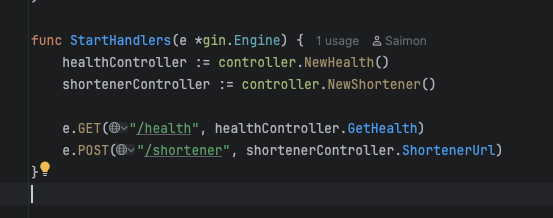
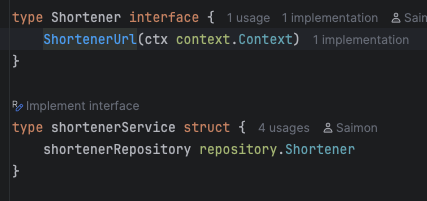

# bootprojetct

# How to Run

* Conferir se o Colima está rodando pelo terminal: `colima status`
* caso não esteja : `colima start`
* rodar um `docker-compose up`

-----

# Dicas
* Adicionar uma rota:
 entre em: `web/handler.go`
  

-------
* Desça a arvore `command + click` em cima da função

------
Toda estrutura é encapsulada, ou seja, apenas importamos as interfaces

